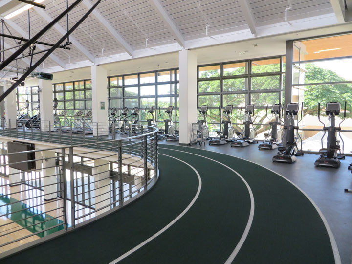

# IsGymCrowded App
## By: Clark DeNunzio and Raena Naka

## Overview (including “The problem” and “The solution”)
Have you been to the [Gym at UH Manoa](https://manoa.hawaii.edu/studentrec/fitnesscenter/hours.html) and it took you an hour and forty-five minutes to complete your thirty minute routine?
The gym at UH is undoubtedly a great facility and it is a great, additional resource for students that pay their activity's fee. However, because of traffic, campus can get crowded around certain times of the day like the lunch hour and particularly at the gym around 3 p.m. when most students finish class. This leads to wait-times and it can be hard to use the equipment you want efficiently.

## Mockup page ideas
Students can login and approve the app to access their class schedule. Their can be a schedule screen where students can pick workouts for certain days. Another tab could include a "Log" so students can track their progress on certain excercise such as the weight they are lifting on particular machines.

## Use case ideas
This app will sync UH users schedules that identify that they use the Gym and recommend an optimal time to go to the gym so that they can "avoid the rush". As the app gains user data, it can begin to cross reference the "Logs" that are being recorded from a drop-down list of machines at the UH gym and sync schedules to avoid possible conflicts.

## Beyond the basics
For example, if a group of four students use the app to identify a good time to each attempt Bench Presses, the app can then identify that it will be a bad time for BenchPresses and recommend alternative times to go so the machine will have higher probability of being open. 

