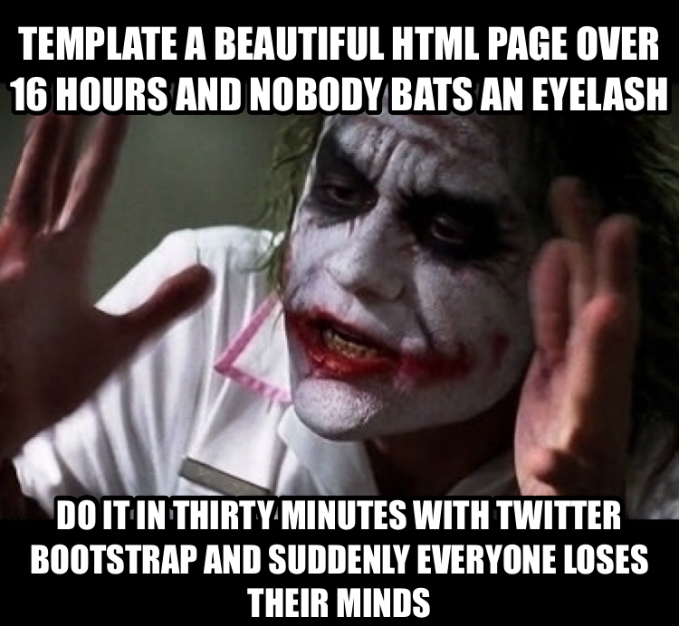

It's almost a given, in this day and age, that a person will know at least a snippet or two of HTML code. After all, blogging has been a social staple since before the change of the millenium! I personally began blogging with the beloved Xanga platform, and ever since then, frontend coding has been something close to my heart. I know I am not alone when I admit that I have spent several sleepless night tweaking my Xanga blog's color schemes, and featured images, to the absolute perfect specifications of a 13-year old track athlete. Whether you began with Xanga, MySpace, or even the early FaceBook, microblogging has thrust HTML into becomming as commonly written as the English language.

While the veterans will always remember the heydays of raw HTML, and Myspace, the new breed of bloggers have been graced with unbelievably powerful frameworks capable of surpassing years of alternative coding experience. For whichever flavour of coding you prefer there is an HTML templating solution, whether it's your choice to use JADE, a brand new, eloquent, whitespace significant syntax language, or, Twitter Bootstrap, a classic-HTML yet, large object-oriented class library. In my experience, I have been just exposed to Semantic-UI, which follows the same paradigm of Twitter Bootstrap, as in, Semantic-UI exposes a collection of classes that I am then free to integrate into my page. For a veteran user of HTML, the Semantic-UI framework was so powerful that reverting to the old paradigm seems almost criminal at this point.

Will the future begin this way? I can honestly say, that within seconds, thanks to the unbelievably organized documentation of Semantic-UI, I was solving problems like navigation, and Javascript bindings which would have caused innummerable headaches if hardcoded by hand. Instead, I am free to "bootstrap" (you think you're so clever, huh, Twitter?) all the work of Semantic-UI's
 developers and, almost like magic, my page now wields fully functional, and complex, elements. To begin to elucidate the meaning of my article's title, I am now concerned with the long-term prospects of being a frontend developer when UI frameworks are so powerful, that even children could theoretically begin templating powerful websites. Time will only tell, although my personal intuition leads me to believe while this may be very possible, given the ease of use of UI frameworks, the sites will start to become easily recognizable by their respective frameworks, which may be undesirable to a professional's client. For example, after learning the Twitter Bootstrap framework, I am able to identify, within seconds of being on a page, just by observing the styling of the menu and buttons, that I am visiting a Twitter Bootstrap website. For this reason, when considering real custom work, it would seem the veteran frontend developers are still going to be needed. Still don't discount young people and their ability to learn new technologies, to repeat myself, time will only tell, given marketing advantages, if an expensive custom website is even worth the investment when measuring against fast, cheap, and effective websites templated with UI frameworks.

