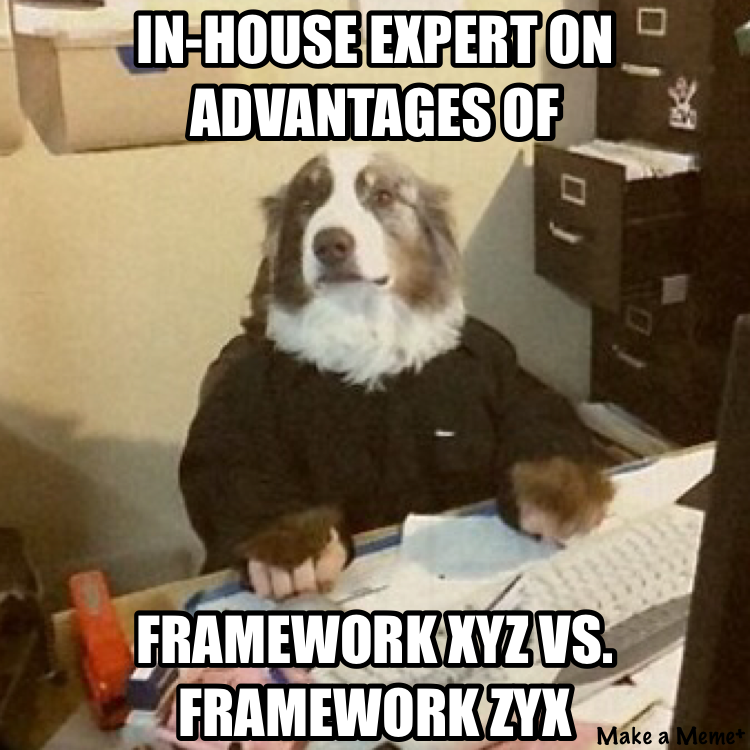

## By: Clark DeNunzio

When it all began I was either watching an episode of ABC's Shark Tank or NBC's The Profit; once I saw what qualified as a passable business plan, I was hooked. 
As an avid gamer and wannabe cyber-athlete, I took to business a new frontier of gaming. 
Unfortunately for many gamers, you always get stuck on wanting the bigger and better item. I mean, the goal is to beat the game, so that seems logical, does it not?
Until considering that perhaps, new techologies are being released faster than your products, and it's time to ship something, anything! 
This is my story as a young man wading into the depths of e-commerce.

I began by researching what's the coolest, most hip frameworks thinking I would gain an edge against others with far more considerable skill than me. All-in-all, I would call it a phase, perhaps an important one. At the end of the day, what made Drupal so much better than Wordpress... They are both PHP CMS softwares, so why was I eating at myself thinking of advantages of one over the other. I already knew WordPress, it felt right to me, but that doesn't mean Drupal is any less powerful. I had reached the point where it was time to ship a piece of code, right or wrong. In the end, the attachment to a framework was not what I took away from the experience.

What I took away was the ability to solve a problem. I aimed to build a WordPress theme from stratch but, in the process I learned the pieces of what constitutes a WordPress site fundamentally. It's a building block of many other frameworks, rather than an allmighty solution to CMS. For example, the [Calypso Admin Interface](https://developer.wordpress.com/calypso/) is more-or-less a custom React.JS UI. Also, the whole beast which is Cascading Style Sheets can be solved in a multitude of ways with the available preprocessors out there. I initially learned [Sass](http://sass-lang.com/) but because, I set out to solve styling as a problem in general, I now find myself more comfortable with [Twitter Bootstrap](http://getbootstrap.com/). 

It's a learning process, and don't take my word for it, but find out for yourself.
