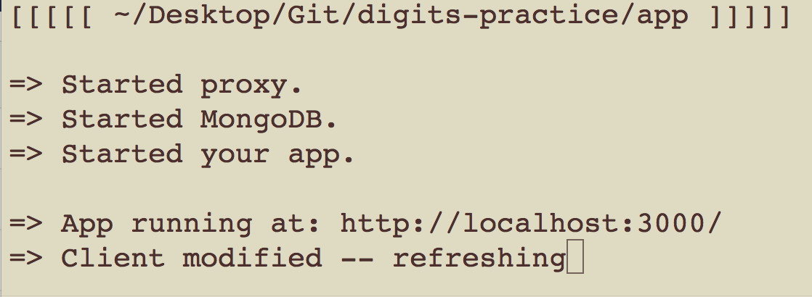

## By Clark DeNunzio

[Meteor.JS](http://meteor.com)

Meteor in general is a different flavour of HTML, CSS, and JavaScript but like with any framework these skills can easily be moulded into the correctly functioning versions of themselves. Overall, working with Meteor has been a joy compared to other frameworks, and I'm impressed with it's out-of-the-box functionality for sure. The only problem is that it's exceptionally heavy-weight... I'm talking super-massive, like orders of orders of magnitude in comparison to other frameworks. For what they are making you buy, it better work out-of-the-box, and it better have intuitive commands. Luckily Meteor actually delivers these entry points, and using the software is actually graceful, once you overlook the gigabytes of Harddrive space being consumed by a measly JavaScipt app.

It's obvious that Meteor isn't going to be for everything because of it's inordinate use of system resources, but it's still cool, and worth considering for production level applications; for a hobbyist, not so much, as the costs of deploying the application are simply too great. Just developing simple tutorials on my local machine has consumed 10 gigabytes of Harddrive space, so I cannot begin to think of the complexity costs of using Meteor at production scale. The framework comes with some interesting features that may explain it's size. Hot-Reloading and distributed miniMongo sessions are, for sure, some worthwhile pieces of technology to take advantage of with Meteor. 

Hot-Reloading: 

  In line the Meteor server will restart and adjust to changes made in the source code. Furthermore, the Meteor server will also ouput intuitive error messages to help the developer debug the application back to a working state. Meteor crashes gracefully and has several nuances to let you know that something is not rigged up properly. Such as stylesheets breaking until a page is fully qualified with working routes. This saves an incredible amount of time, believe it or not.

Mini-Mongo: 

  Meteor uses MongoDB as it's backend leveraging a service called miniMongo in use with the actual Application itself. MiniMongo is a localized session of the Application's MongoDB database that is active among all the sessions of all the users on the Application. Meteor has a centralized location of MongoDB that it will automatically tabulate and, to preserve the integrity of the centralized MongoDB, it will issue sessions of miniMongo to the users with access to just the collections they need. Once the user closes their session, MongoDB will then recursively add the changes of their miniMongo session back into the centralized MongoDB and redistribute the changes to the remaining miniMongo sessions. This powerful tool shows of the asyncronous paradigm off JavaScript.

Other than that, it's just another JavaScript framework among all the others that we have come to know and love. Using Meteor, however, with it's robust and complete toolset makes for an incredible learning experience. To just be able to identify and correctly use MongoDB after coming from a pure frontend background is nothing short of miraculous in my opinion. By deep diving into Meteor, a developer can familiarize themselves with all of the defacto standards of the web at this moment in time. I encourage all readers to at least investigate Meteor at some point in time, although it is an extraordinarily large framework, the chance to learn new web development caveats is well worth your harddrive space.

