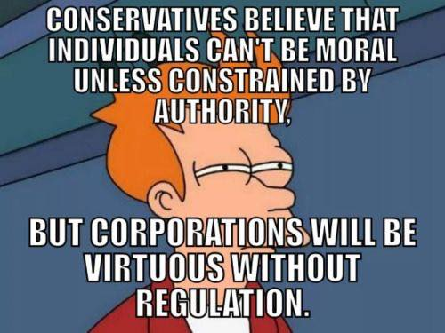

We all hit those inevitable walls in life when we wonder if what we are doing is really important or relevant to who we are and, if perhaps, our time would be better spent as an artist, comedian, or bartender.
And through my existence, I've come to realize that these are the times when a chance at true growth is on the table. Let us ask the existential questions we have been ignoring.
Is the use of coding standards worth the movement toward authoritarian rule in our society? Is it only a matter of time before the coders trade in their Linux or C for something borne in a marketing deparment?

Under the Trump administration, a new disturbing trend of corporate greed hidden under the guise of nationalism has risen in this country. It is true that several CEOs of Silicon Valley tech companies have been known to support this vile paradigm. Facebook, a company with millions of users, went as far as to turn a blind-eye to the startling amount of political misinformation being spread. The problem was so bad, it was almost investigated as election rigging. We are talking about Facebook, the creators of React.Js, getting owned by social media hackers that were essentially bandwagoning neo-nazism. A false and slanderous article may get removed after 100,000 views, to what end, as all the damage has been done already. Yes, React.Js is a revolutionary UI framework, yes, Facebook has exponentially higher customer reach than their competitors but, at what point is a piece of software worth our integrity? 

However, returning to my first point, at this impasse, there is a chance for true and honest growth. Let us realize that people survived without these softwares to begin with. However, it goes without saying, there was a problem the software was created to solve and that problem in computer science doesn't have human prejudices attached to it. As we speak, AirBnB is profiting for the benefit of investors in Trump's cabinet, the same people passing laws to pour coal debris in local streams. But, the ability to learn their software caught me up to speed with the professional Javascript coding standards of the world. A trade off that we need to seperate ourselves from; coding standards are not exclusive to AirBnB, learn the enemies tactics and use it against them. Learn the problem, you can build a house without a hammer and nails, the problem is that you need a home, not that you lack tools. It would seem, however, my paradigm is grower more and more outdated, and as the lack of diversity grows, so will the strength of concepts of standardization. Just as the height of civilization has risen us to command technology, we also know trillions upon trillions of lifeforms had to perish so we could do so.
