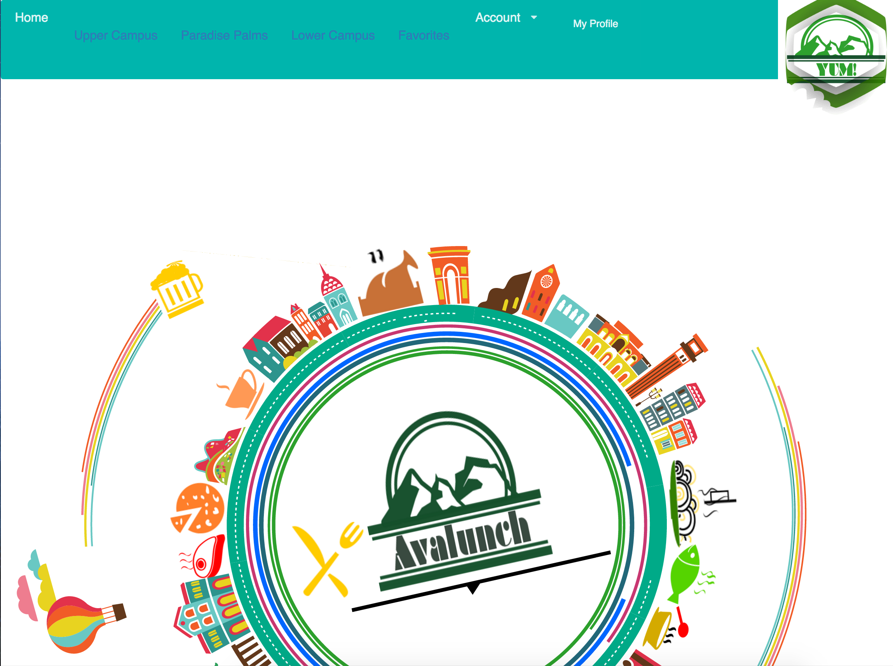
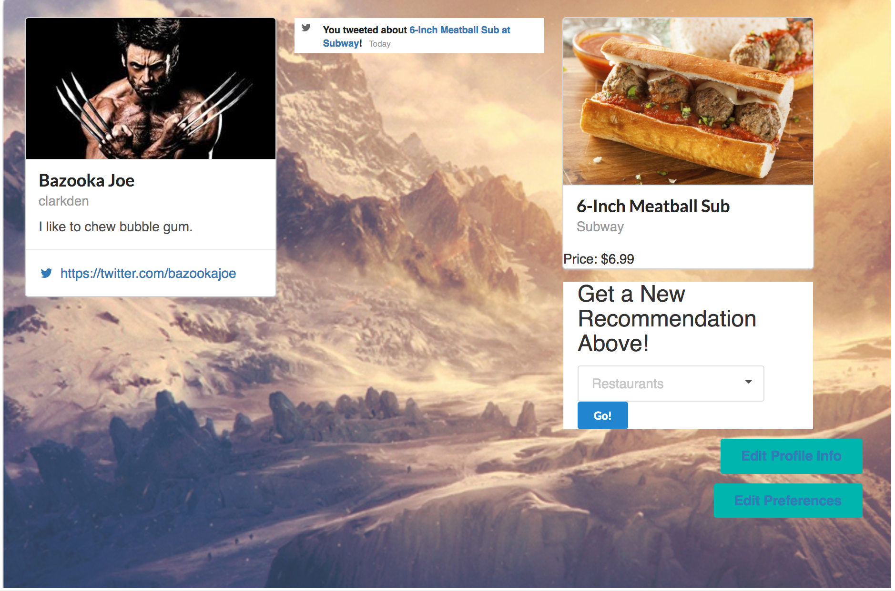

# AvaLunch at University of Hawaii: Manoa

Welcome to AvaLunch, this project was completed by three team members over the course of 30 days.

Please view our [GitHub Organization](https://github.com/avalunch) to learn more about the team members.

All source code for our project can be found on GitHub [here](https://github.com/Avalunch/Avalunch).

Or, please, take our guided walkthrough [here](https://avalunch.github.io).

## AvaLunch in a nutshell

AvaLunch analyzes current food preferences and favorites with respect to the student currently logged-in, and helps students navigate the campus with an interactive SVG-mapped menu on top of a data-driven backend to improve recommendations.

AvaLunch helps  students evaluate the sometimes overwhelming number of food choices and the varying properties of the meals they are seeking for proper nutrition, and determine ways to invest their time most productively during what may be a short lunch break period.

AvaLunch also helps students by providing data-backed evidence regarding the favorites, previously-tweeted, and other new recommendations based on browsing and shopping history.

## My Role In AvaLunch

